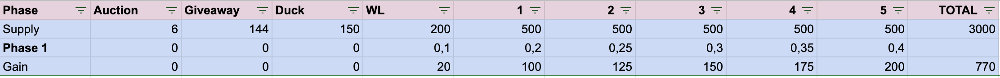

# Lynxee NFT Collection

Rust based smart-contract for the #NFT Lynxee project on Elrond's network

## Install

### Requirements

- erdpy official erlong cli app
- rust

### Scripts

```bash
# compile contract
erdpy contract build

# run mandos tests
erdpy contract test
```

Note: Sometime when you are updating the contract interface, the build failed without rust error. Just remove the meta crate cache and re-build.

```sh
rm -rf ./meta/target
```

### IPFS test collection

- metadata: [`bafybeia4lqhl7g7wdd65ye76rw2s25ladr7khixevqeyjnao6azpwkjr2m`](https://bafybeia4lqhl7g7wdd65ye76rw2s25ladr7khixevqeyjnao6azpwkjr2m.ipfs.dweb.link/)
- images: [`bafybeiejtr7dewbts7uqrffwso4c6pvpkceiqqwninpv3qqkizlaqzaftu`](https://bafybeiejtr7dewbts7uqrffwso4c6pvpkceiqqwninpv3qqkizlaqzaftu.ipfs.dweb.link/)

## Flow

First steps - setup the collection - owner only

1. Build the rust contract to wasm.
2. Deploy the smart-contract (SC) on the blockchain. It calls the `init(...)`. Here, we inject project settings.
3. Issue the token, set the name, the ticker.
4. Set roles (to be able to create tokens).
5. (optional) pre-mint for the team and for the giveaways

At this step, the collection is almost ready (the mint requires to be activated), we can start the mint journey.
Everyone can mint, it costs EGLD, this action will be on our dapp (website).

6. Activate the mint journey by calling `startMinting` endpoint.
7. Pay, mint and transfer a token.
8. At the end of the 3000 items, close the mint function.
9. (question) The transfer, auctions, erc-721 interface (...) methods must be implemented in the current SC or are performed by the marketplaces or the elrond API?

## Structure

List of the methods and storage. The checkbox checked indicate that the feature is tested using mandos.

Note: Using RipGrep (grep rewritten in rust), you can quickly generate the API

```sh
# make it executable (may require "sudo" before)
chmod +x ./bin/generate_api.sh

# Generate API
./bin/generate_api.sh
```

### Endpoints

- `issueToken()`
- `setLocalRoles()`
- `giveaway()`
- `giveawayMany()`
- `setRoyalties()`
- `mint()`

### View

- `getMintPrice()`
- `getMintedCount()`
- `getSoldCount()`
- `getTokenId()`
- `getTokenName()`
- `getJsonCid()`
- `getImageCid()`

### Storage

- `tokenId`
- `tokenName`
- `jsonCid`
- `imageCid`
- `tags`
- `mintedIds`
- `soldMintedIds`
- `royalties`

## Supply distribution and mint process



We will reserve 300 NFTs

- 6 auctions (selected)
- 144 giveaway (including 2 for each team members (4)(selected)) (free)
- 150 for the Duck friends (free)

Then for the 2700 left item, the price will grow by mint count steps from 0.1 EGLD to 0.4 EGLD.

Note: The 10 first NFT (4 for the team, 6 auctions)  from id 1 to 10 will be locked. Only the owner can mint and transfer it.

## Test deploy on prod

Images built using [HashLips](https://github.com/HashLips/hashlips_art_engine).

We will deploy 50 lips + 10 reserved images on IPFS using nft.storage (`car` format)

Then regenerate (still with HashLips) json files and create manually the 10 reserved.

Images: `bafybeidfyg4tkxazcrih3eaocpwn4m67vyhcuocrujwple6yjolxktniqm`
JSON  : `bafybeiewbfwy2c33zzrn6u57z6ymni4jixdscryj7jovyuiknsklfqb4n4`

> Note: For this test, the uniques are the first 10 from 1 to 10, but the SC and the real collection will have 16 uniques at first from 1 to 16.

Once the assets uploaded on IPFS, we can deploy the contract on the testnet

### Deploy

SC Owner: `erd1xe52d0yvd5q9r8t2jh73gqq6mkxzzmmd72l7padm630ksa0jjg9qypwlta`

For each scripts in the `./bin` folder, look inside the variable before running it.

```sh
# Deploy the SC
./bin/deploy.sh
# will generate the contract address, copy it to paste it in all next steps

# Issue the Token
./bin/issue.sh

# Set the roles to be able to mint
./bin/set_roles.sh
```

Now the contract and the token are ready to work.

```sh
# Mint: Cost EGLD - Public - Random id
./bin/mint.sh

# Giveaway: Send one random, one precise or many NFt to an address
# See more about params in the file itself
./bin/giveaway.sh
```
